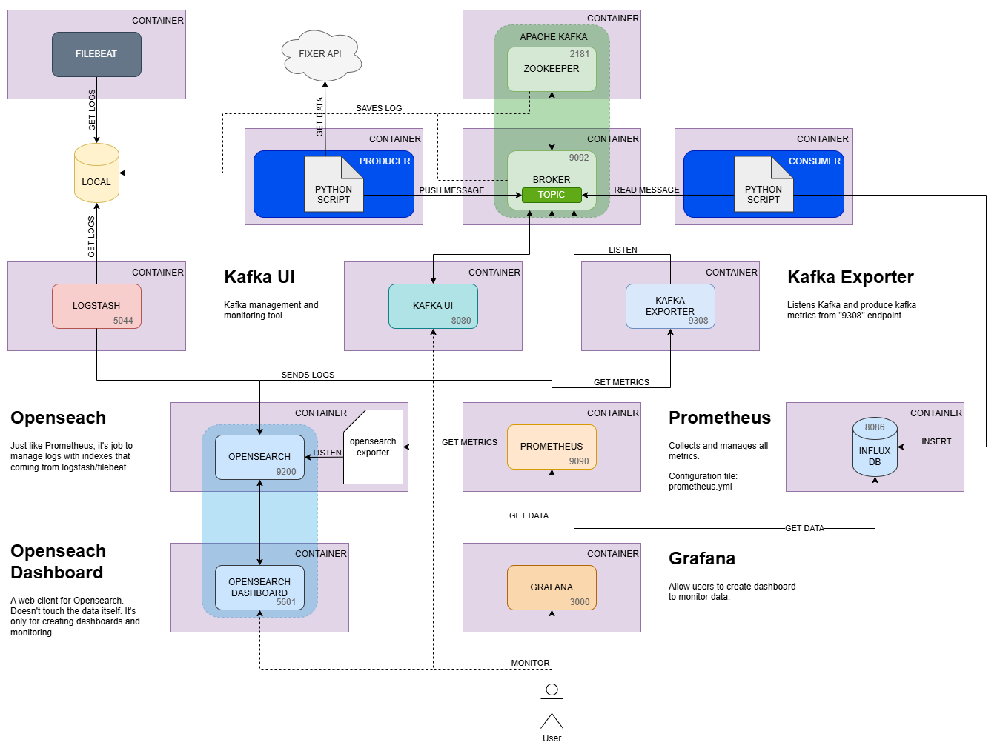

## Docker Commands
- To check if any container is running: `docker ps`
- Check all containers: `docker ps -a`
- To run docker compose file: `docker compose up -d`
- To stop docker compose file: `docker compose down`
- To stop specific container: `docker stop <CONTAINER_ID>/<CONTAINER_NAME>`
- To connect into container: `docker exec -it <CONTAINER_ID>/<CONTAINER_NAME> bash`
    > To exit from container: `exit`
- 

> Go to `https://fixer.io/#pricing_plan` and create a free subscribe. Get the `API_KEY` from there.

### .env Variables
```
# GRAFANA CONFIGURATIONS
GF_SECURITY_ADMIN_USER=
GF_SECURITY_ADMIN_PASSWORD=

# KAFKA CONFIGURATIONS
FIXER_TOPIC_NAME=
FIXER_PARTITION_COUNT=
FIXER_REPLICA_COUNT=
CONSUMER_GROUP_ID=

# INFLUX CONFIGURATIONS
INFLUXDB_DB_NAME=
INFLUXDB_MEASUREMENT_NAME=

# LOGSTASH to KAFKA CONFIGURATIONS
BROKER_LOG_TOPIC_NAME=
BROKER_LOG_PARTITION_COUNT=
BROKER_LOG_REPLICA_COUNT=

ZOOKEEPER_LOG_TOPIC_NAME=
ZOOKEEPER_LOG_PARTITION_COUNT=
ZOOKEEPER_LOG_REPLICA_COUNT=

PRODUCER_LOG_TOPIC_NAME=
PRODUCER_LOG_PARTITION_COUNT=
PRODUCER_LOG_REPLICA_COUNT=

# FIXER API KEY
API_KEY=
```

